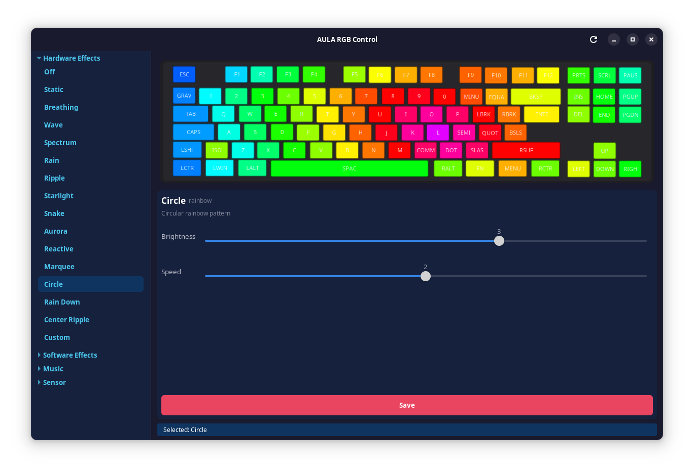
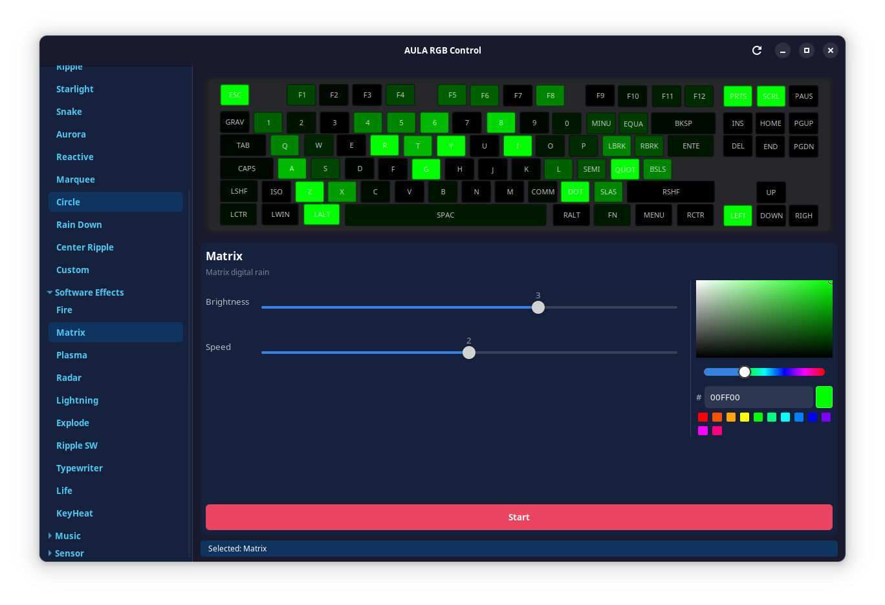
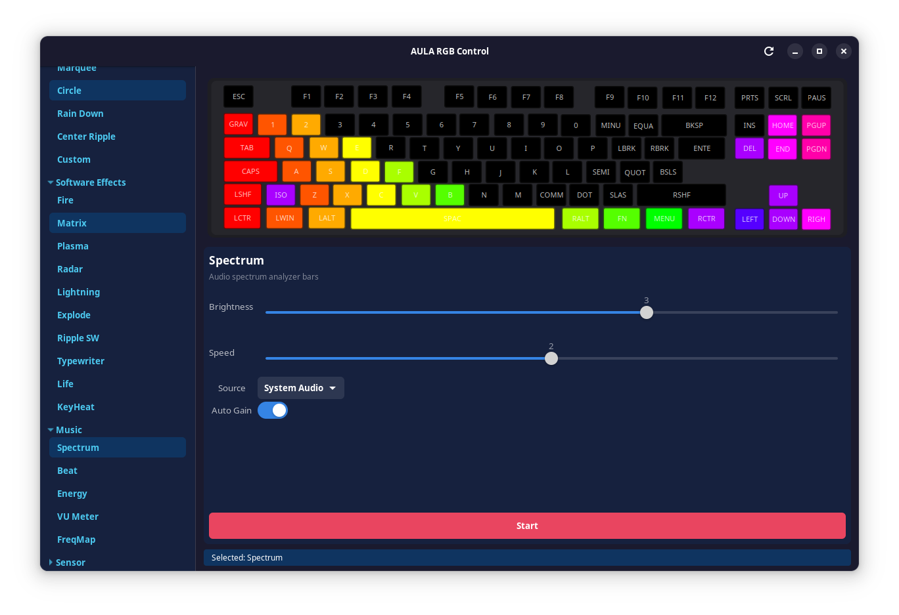
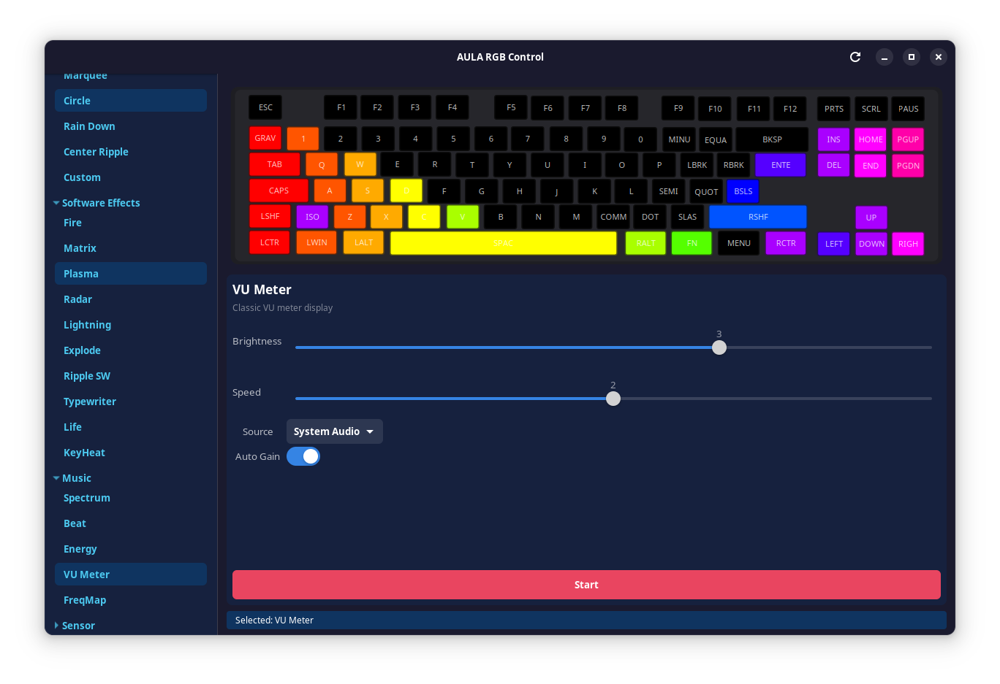

[English](README.md) | [Türkçe](README.tr.md)

# aula-rgb-controller

**AULA** mekanik klavyeler için Linux RGB aydınlatma kontrolü. Tersine mühendislik ile çözülmüş USB HID protokolü.

> Tuş bazlı RGB kontrol, 18 donanım efekti, 12 yazılım efekti, müziğe tepkili aydınlatma ve sistem sensör görselleştirmesi — Windows yazılımına gerek kalmadan.

## Desteklenen Klavyeler

Şu anda **AULA F87 TK** ile test edilmiştir. Aynı SinoWealth yonga setini kullanan diğer AULA klavyeler (F75, F87 Pro, F99) de çalışabilir — katkılarınız ve test raporlarınız memnuniyetle karşılanır!

## Özellikler

- **18 donanım efekti** — dalga, nefes, yağmur, dalgalanma, yıldız, yılan, aurora ve daha fazlası
- **12 yazılım efekti** — ateş, matrix, plazma, ısı haritası, radar, şimşek, patlama, dalgalanma, daktilo, yaşam oyunu, tuş ısısı, sensör katmanı
- **5 müzik görselleştirici** — spektrum, ritim nabzı, enerji dalgası, VU metre, frekans haritası (PulseAudio/PipeWire)
- **Sensör izleme** — CPU sıcaklığı/yükü, GPU sıcaklığı, RAM kullanımı klavye tuşlarına renk geçişleriyle eşlenir
- **Tuş bazlı RGB** — CLI veya GUI boyama modu ile tek tek tuş renkleri belirleyin
- **GTK4 arayüz** — canlı klavye önizleme, HSV renk seçici ve sürükle-bırak sensör editörü
- **D-Bus arka plan servisi** — hotplug algılama ve otomatik yeniden bağlanma

## Ekran Görüntüleri

| Donanım Efekti (Circle) | Yazılım Efekti (Matrix) |
|:---:|:---:|
|  |  |

| Müzik Görselleştirici (Spectrum) | Müzik Görselleştirici (VU Meter) |
|:---:|:---:|
|  |  |

## Gereksinimler

### Derleme Bağımlılıkları

**Debian / Ubuntu:**
```bash
sudo apt install libusb-1.0-0-dev libjson-c-dev libpulse-dev libsystemd-dev cmake build-essential
```

**Fedora:**
```bash
sudo dnf install libusb1-devel json-c-devel pulseaudio-libs-devel systemd-devel cmake gcc make
```

**Arch Linux:**
```bash
sudo pacman -S libusb json-c libpulse systemd cmake base-devel
```

**Opsiyonel (GUI için):**

**Debian / Ubuntu:**
```bash
sudo apt install libgtk-4-dev libadwaita-1-dev
```

**Fedora:**
```bash
sudo dnf install gtk4-devel libadwaita-devel
```

**Arch Linux:**
```bash
sudo pacman -S gtk4 libadwaita
```

## Hızlı Başlangıç

```bash
# Klonla
git clone https://github.com/veysiemrah/aula-rgb-controller.git
cd aula-rgb-controller

# udev kurallarını kur (root olmadan USB erişimi için gerekli)
sudo cp udev/99-f87.rules /etc/udev/rules.d/
sudo udevadm control --reload-rules && sudo udevadm trigger

# Derle
mkdir build && cd build
cmake .. -DCMAKE_BUILD_TYPE=Release
make -j$(nproc)

# Testleri çalıştır
ctest --output-on-failure

# Kur (opsiyonel)
sudo make install
```

### Derleme Seçenekleri

| Seçenek | Varsayılan | Açıklama |
|---------|------------|----------|
| `BUILD_CLI` | ON | Komut satırı aracı (`f87ctl`) |
| `BUILD_DAEMON` | ON | D-Bus arka plan servisi (`f87d`) |
| `BUILD_GUI` | OFF | GTK4 arayüz (`f87control`) |

```bash
# GUI dahil her şeyi derle
cmake .. -DCMAKE_BUILD_TYPE=Release -DBUILD_GUI=ON
```

## Kullanım

### Daemon Modu (Önerilen)

Daemon'u başlatın:
```bash
# Manuel
./build/f87d &

# Veya systemd ile
systemctl --user enable --now f87d
```

Ardından CLI veya GUI kullanın:
```bash
# Cihaz bilgisi
f87ctl info

# Donanım efektleri
f87ctl effect wave --brightness 4 --speed 2
f87ctl effect breathing --color ff0000

# Tuş bazlı renkler
f87ctl key set ESC ff0000
f87ctl key set-all 00ff00

# Yazılım efektleri
f87ctl animate fire
f87ctl animate matrix

# Müziğe tepkili
f87ctl music spectrum
f87ctl music beat

# Parlaklık
f87ctl brightness 3

# Efektleri durdur / kapat
f87ctl stop
f87ctl off
```

### Doğrudan Mod (Hata Ayıklama)

Daemon'u atlayarak doğrudan USB erişimi:
```bash
f87ctl --direct info
f87ctl --direct effect wave
f87ctl --direct raw send "06 82 01 00 01 00 06"
```

### GUI

```bash
f87control
```

GTK4 arayüz şunları sunar:
- Canlı efekt animasyonlu klavye önizleme
- Tıkla-boya tuş renk atama
- Hex girişli ve hazır paletli HSV renk seçici
- Sürükle-bırak sensör izleme editörü

## Mimari

```
F87Control
├── libf87 (lib/)         Paylaşımlı C kütüphanesi — USB HID protokolü, efektler, ses, sensörler
├── f87d (daemon/)        D-Bus arka plan servisi — cihaz yönetimi, efekt yaşam döngüsü
├── f87ctl (cli/)         Komut satırı aracı
└── f87control (gui/)     GTK4 + libadwaita arayüz
```

İletişim akışı:
```
GUI / CLI  ──D-Bus──>  f87d daemon  ──USB HID──>  AULA F87 TK klavye
```

## Desteklenen Donanım

| Model | VID:PID | Bağlantı | Durum |
|-------|---------|----------|-------|
| AULA F87 TK | `258A:010C` | USB Kablolu | Tam test edildi |
| AULA F87 Pro | `258A:010C` | USB Kablolu | Çalışması beklenir (test edilmedi) |
| AULA F75 / F99 | `258A:*` | USB | Çalışabilir (test edilmedi) |

> **Not:** Birçok klavye markası SinoWealth çipleri (VID `258A`) kullanır, ancak modeller arasında protokoller farklıdır. Desteklenmeyen bir klavyede bu aracı kullanmak çalışmayabilir. Listede olmayan bir AULA modeliniz varsa, lütfen `f87ctl --direct info` çıktınızla bir issue açın.

## Protokol Dokümantasyonu

USB HID protokolü, Windows USB yakalamalarından tersine mühendislik ile çözülmüştür. Ayrıntılar için [`tools/protocol_notes.md`](tools/protocol_notes.md) dosyasına bakın:

- HID feature report yapısı
- 4 adımlı yazma protokolü
- Tuş bazlı renk kodlaması (düzlemsel RGB)
- Efekt parametre kodlaması
- Doğrudan mod animasyon protokolü

## Katkıda Bulunma

Katkılarınız memnuniyetle karşılanır! Bu proje şunları kullanır:

- **C11** ve CMake >= 3.16
- **libusb** — USB HID iletişimi
- **sd-bus** (systemd) — D-Bus arka plan servisi
- **GTK4 + libadwaita** — grafik arayüz
- **PulseAudio** — ses yakalama
- **KissFFT** — spektrum analizi

### Tepkisel Efektler İçin (Tuş Girişi Yakalama)

```bash
sudo usermod -aG input $USER
# Grup değişikliğinin etkili olması için oturumu kapatıp açın
```

## Lisans

Bu proje **GNU Genel Kamu Lisansı v3.0** kapsamında lisanslanmıştır — ayrıntılar için [LICENSE](LICENSE) dosyasına bakın.
